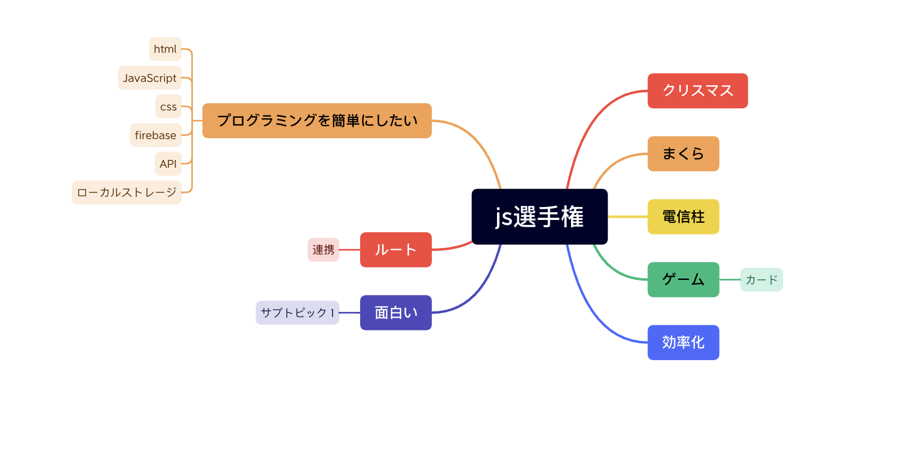

# 2022/11/15

チーム名
もっちりコンバット
88→ ラジウム
みそしる革命
もっちりラジウム革命

明日までにな各々なにか案を考えてくること！

# 2022/11/16

画像認識できた！
https://github.com/tensorflow/tfjs-models/tree/master/mobilenet

テンソルフロウモデル一覧
https://www.tensorflow.org/js/models?hl=ja

figma 開始！

## やったこと

git flow
figma
tesorflow
github issue

## 決定事項

- 画面サイズは 390\*844 iphone 14 のサイズとする。
- とりあえず JavaScript でつくる。
- 時間があったらアプリ作る

### プロダクト

1. 写真撮る
2. 認識する
3. ラベル(認識結果)を出す
4. ラベルに紐付いたテキストを表示する
